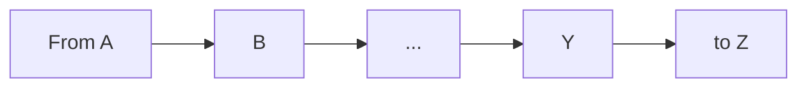
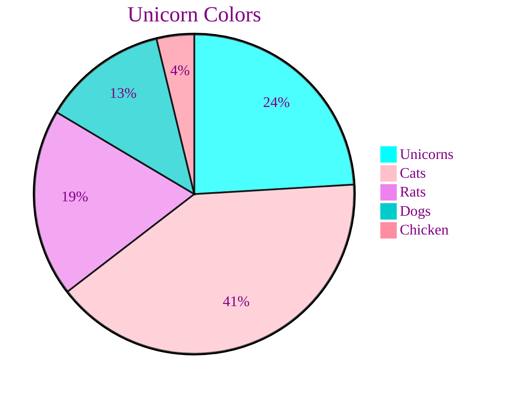
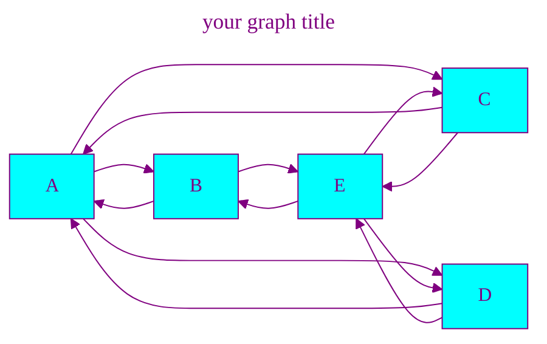
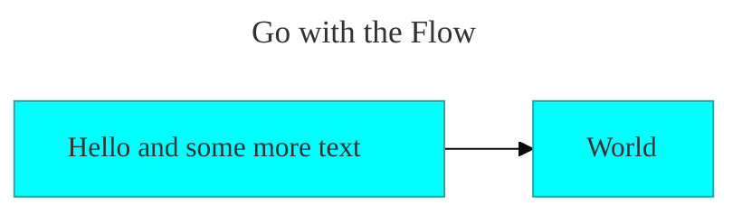
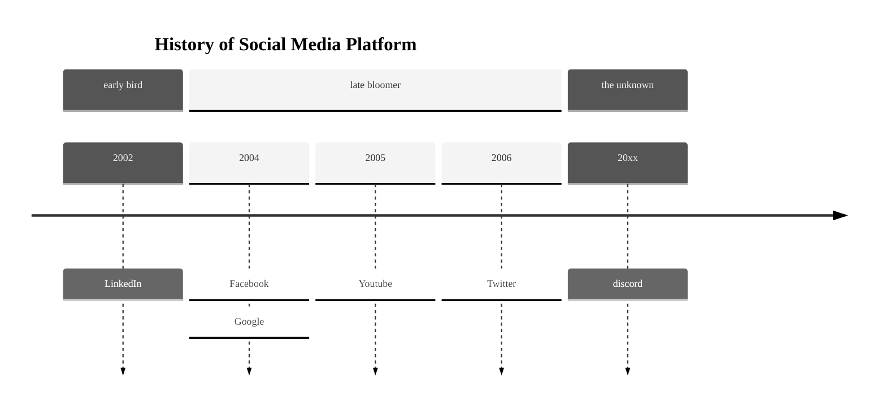
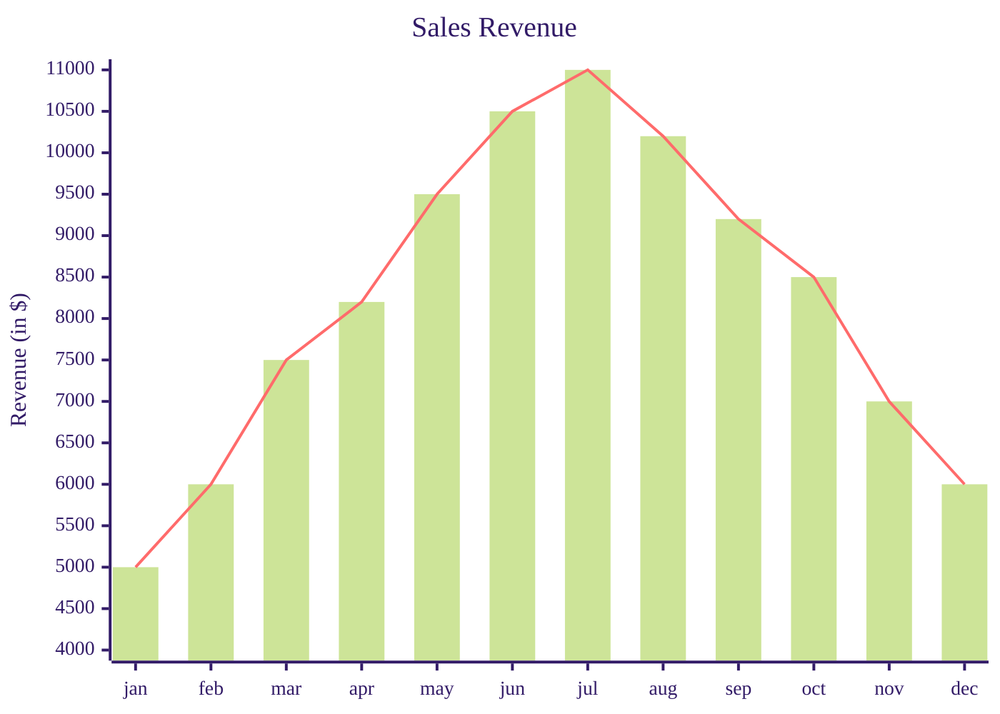
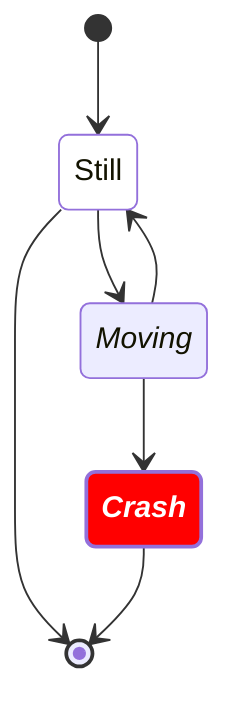

# Charts with Mermaid



---

## Optional Styling

### Use YAML frontmatter within `mermaid`-code block

> See [Directives](https://mermaid.js.org/config/directives.html) and [Mermaid Theme Config](https://mermaid.js.org/config/theming.html)

---

## Examples

- set a title with `title`
- `config`:
  - `theme`: _[base, default, forest, dark, neutral, null]_
    - use `base` when you want your own coloring (see below)
  - `themeVariables`:
    - `fontFamily`: _[sans-serif, serif, monospace]_ or use local installed fonts
    - Colors - CSS name, rgb(hex - preferred), or hsv:
    - `textColor`, `lineColor`,
    - `primaryColor`, `primaryTextColor`, `primaryBorderColor`,
    - same for `secondaryColor`, `tertiaryColor`

---

## Pie Chart - Mermaid Graph



---

## Pie Chart - Mermaid Code

```yaml
---
title: Unicorn Colors
config:
  theme: base
  themeVariables:
    textColor: purple
    primaryColor: aqua
    secondaryColor: pink
    tertiaryColor: violet
    fontFamily: sans-serif
---
pie
    "Unicorns" : 190
    "Cats" : 320
    "Rats" : 150
    "Dogs": 100
    "Chicken": 30
```

---

## Graph

##### with coloring!



---

## Flowchart



---

## Timeline



---

## XY-Chart

##### still with sizing problems



---

## State Diagram

### with coloring


